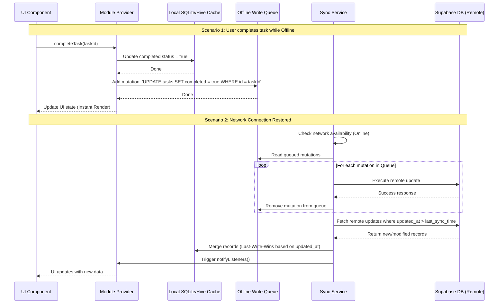

# God's Plan - System Architecture & High-Level Design (Supabase & Cloud Sync)

This document outlines the architecture, data models, state management, storage strategy, and service definitions for **God's Plan**, an offline-first personal operating system app built with Flutter and backed by **Supabase (Free Tier)** for authentication and cloud synchronization.

---

## 1. High-Level Architecture Overview

God's Plan uses a clean, decoupled client-server architecture optimized for offline resilience, cloud synchronization, and modular growth. The architecture is split into four distinct layers:

1. **Presentation Layer (UI)**: Custom Flutter widgets, responsive layouts, and utility-based styling.
2. **State Management Layer (Providers)**: Manages UI state, coordinates offline caching and sync, and triggers state updates using the Provider package (or Riverpod).
3. **Service Layer (Business Logic & Backend Integrations)**:
   - **Supabase Service**: Manages secure authentication and remote table synchronization.
   - **Sync Service**: Directs bi-directional synchronization, conflict resolution, and handles the offline queue.
   - **Notification Service**: Manages local OS reminders.
   - **AI Coach Service**: Generates daily tips using local rule-based analysis to avoid paid API costs.
4. **Data Layer (Storage)**:
   - **Local Cache**: Hive for key-value settings/auth status, and SQLite for structured logs (food, tasks, sleep) and transactions.
   - **Remote Storage**: Supabase Database (PostgreSQL) with Row-Level Security (RLS) enabled.

### Architectural Diagram

```mermaid
graph TD
    subgraph Presentation Layer [UI Component Layer]
        MainDash[Main Dashboard]
        TaskScreen[Task Screen]
        NutriScreen[Nutrition Screen]
        FitScreen[Fitness Screen]
        SleepScreen[Sleep Screen]
        AddictScreen[Addiction Screen]
        FinScreen[Finance Screen]
        LearnScreen[Learning Screen]
        AuthScreen[Sign Up / Login Screen]
    end

    subgraph State Management Layer [Providers]
        AuthProv[Auth Provider]
        GoalProv[Goal Provider]
        TaskProv[Task Provider]
        NutriProv[Nutrition Provider]
        FitProv[Fitness Provider]
        SleepProv[Sleep Provider]
        AddictProv[Addiction Provider]
        FinProv[Finance Provider]
        LearnProv[Learning Provider]
    end

    subgraph Service Layer [Core Services]
        SupabaseService[Supabase Service]
        SyncEngine[Sync & Cache Engine]
        DBService[Database Service]
        NotifyService[Notification Service]
        LocalAIService[Local Heuristic AI Coach]
    end

    subgraph Storage Layer [Data Store]
        HiveDB[(Local Hive NoSQL - Cache/Auth)]
        SQLiteDB[(Local SQLite - Structured Logs)]
        SupabaseDB[(Supabase PostgreSQL - Cloud Storage)]
    end

    %% Interactions
    Presentation Layer -->|Reads state / Triggers actions| State Management Layer
    State Management Layer -->|Queries / Persists data| Service Layer
    Service Layer -->|Local CRUD / Cache| DBService
    DBService --> HiveDB
    DBService --> SQLiteDB
    Service Layer -->|Cloud Sync / Auth| SupabaseService
    SupabaseService -->|Secure SSL Connection| SupabaseDB
    SyncEngine -->|Coordinates Sync / Offline Queue| DBService
    SyncEngine -->|Flushes mutations| SupabaseService
    NotifyService -->|Local OS Notifications| Presentation Layer
```

---

## 2. Directory Structure

The project structure keeps components, models, logic, and resources strictly isolated:

```
lib/
├── main.dart                       # App entry point, initializes Supabase, Hive, and Services
├── models/                         # Domain entities & serialization
│   ├── goal.dart                   # Overall timeline goals
│   ├── task.dart                   # Daily tasks and routines
│   ├── exercise.dart               # Workout and step logs
│   ├── nutrition.dart              # Meals, foods, and macro/micronutrients
│   ├── sleep.dart                  # Sleep logs and quality scores
│   ├── addiction.dart              # No Fap streaks, urge and relapse logs
│   ├── finance.dart                # Income, expenses, and savings targets
│   ├── social.dart                 # Friend contact lists and log entries
│   ├── learning.dart               # Subjects and study duration logs
│   ├── health.dart                 # Mood, stress levels, and meditation logs
│   ├── sync_item.dart              # Local offline write queue item model
│   └── user_profile.dart           # User bio and goals configuration
├── screens/                        # UI Screens & Widgets
│   ├── auth/                       # Supabase User Auth screens
│   │   ├── login_screen.dart
│   │   └── signup_screen.dart
│   ├── goal_setup.dart             # Initial setup onboarding flow
│   ├── dashboard.dart              # Home tab & summaries
│   ├── tasks/                      # Tasks module views
│   ├── exercise/                   # Workout tracker views
│   ├── nutrition/                  # Food logger & recipe builder
│   ├── sleep/                      # Sleep tracker logs & charts
│   ├── addiction/                  # Urge log and streak views
│   ├── finance/                    # Income/Expense tracker screens
│   ├── social/                     # Friend logs & messaging helpers
│   ├── learning/                   # Study schedules & subject pages
│   └── widgets/                    # Shared reusable UI widgets (cards, bars)
├── services/                       # Core service implementations
│   ├── supabase_service.dart       # Supabase client wrapper & Auth SDK
│   ├── sync_service.dart           # Bi-directional sync & offline queue manager
│   ├── database_service.dart       # Hive & SQLite init and CRUD management
│   ├── notification_service.dart   # Local schedule reminders
│   ├── ai_service.dart             # Local rules analysis (deterministic local rules)
│   └── analytics_service.dart      # Generates weekly/monthly charts and reports
├── providers/                      # State Management (Notifier classes)
│   ├── auth_provider.dart
│   ├── goal_provider.dart
│   ├── task_provider.dart
│   ├── nutrition_provider.dart
│   ├── fitness_provider.dart
│   ├── sleep_provider.dart
│   ├── addiction_provider.dart
│   ├── finance_provider.dart
│   └── learning_provider.dart
└── utils/                          # Shared constants and helpers
    ├── constants.dart              # String literals and config (Supabase URL, Anon Key)
    ├── colors.dart                 # Unified theme palette
    └── helpers.dart                # DateTime parsing, calorie converters
```

---

## 3. Storage Strategy: Hybrid Offline-First Architecture

To ensure the application remains **fully functional offline** and uses **100% free cloud hosting**, we combine local databases with Supabase Free Tier.

### Local Cache Layer
* **Hive (NoSQL)**: Keeps credentials, current session token, theme configurations, goals parameters, offline sync queue metadata, and user streaks.
* **SQLite**: Keeps all transactional records (Tasks list, Food Database, Meal logs, Sleep records, Workout logs).

### Cloud Storage Layer (Supabase Free Tier)
All database tables are mirrored in Supabase PostgreSQL database. Access is protected by **Row-Level Security (RLS)**:
* Each table has a `user_id` column referencing `auth.users.id`.
* The security policy is defined as:
  ```sql
  CREATE POLICY "Users can only access their own data"
  ON public.tasks
  FOR ALL
  USING (auth.uid() = user_id)
  WITH CHECK (auth.uid() = user_id);
  ```

---

## 4. Bi-Directional Synchronization & Offline Sync Flow



---

## 5. Security & Authentication Model

* **Authentication**: Supabase Auth handles password hashing and session tokens using secure JSON Web Tokens (JWT).
* **Local Persistence**: User authentication tokens are securely encrypted using Hive secure box features and persisted locally to bypass repeating login prompts.
* **Zero Trust Database**: Supabase RLS is enabled on all tables, preventing user A from viewing or writing to user B's records, even if they have database access keys.

---

## 6. Build & Deployment Architecture

Because compilation requires a macOS environment, the build pipeline is automated via **GitHub Actions** and sideloaded via **Sideloadly**:

1. **CI Build (GitHub Actions)**:
   - Configured in `.github/workflows/build_ios_ipa.yml`.
   - Fires on pushes to `main`/`master` branches.
   - Spins up a virtual `macos-14` runner.
   - Installs Flutter, downloads plugins, builds an unsigned iOS release (`flutter build ios --release --no-codesign`).
   - Packages the Runner application bundle into an `app.ipa` payload and uploads it as an artifact.
2. **Sideloading (Sideloadly)**:
   - Downloads the compiled `app.ipa` to a Windows machine.
   - Uses a standard Apple ID to sign the IPA with a free 7-day developer certificate.
   - Installs the app via USB directly to the iPhone.
   - The user trusts the developer profile in iOS settings (`General > VPN & Device Management`) to launch the application.

---

## 7. App Branding & Logo Assets

* **App Name**: God's Plan
* **App Launcher Icon**: The application utilizes the logo assets stored in the `assets/` directory (`app_logo_1.jpg` or `app_logo_2.jpg`).
  - The logo is configured at a **1:1 aspect ratio** to fit Apple's square app icon requirements.
  - Using the `flutter_launcher_icons` plugin, the 1:1 image is automatically resized and generated into all required resolutions under `ios/Runner/Assets.xcassets/AppIcon.appiconset`.
